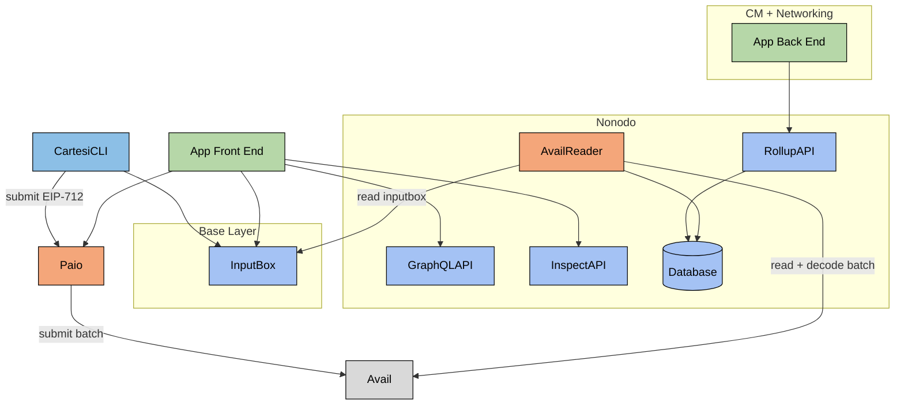

# Avail + Cartesi

Diagram:



## Environment Variables

- **`AVAIL_RPC_URL`**
  Default value: `wss://turing-rpc.avail.so/ws`
  Description: URL for connecting to the Avail RPC. For more details, see [WSS Endpoints](https://docs.availproject.org/docs/networks#turing-testnet).

- **`AVAIL_MNEMONIC`**
  Description: Mnemonic phrase used to send data to Avail.

- **`L1_READ_DELAY_IN_SECONDS`
  Default value: 300 (5 minutes)
  Description: Defines the delay period, in seconds, that the system should wait before attempting to read from the L1 based on Avail's block timestamp.

## Nonodo

Build:

```bash
go build .
```

Run with avail + debug + sqlite

```bash
./nonodo --avail-enabled -d --sqlite-file db.sqlite3
```

## Sending a Transaction

```bash
curl --location 'http://localhost:8080/transactions' \
--header 'Content-Type: application/json' \
--data '{
    "signature": "0x373ca4d18d48e1fe3698971968e068e964effb1d36bab4b0204fa8aa1c7449f3517bb4b9b964554e6c81467399355580e0840b426a7855bd0c8e178368c584d61c",
    "typedData": "eyJ0eXBlcyI6eyJDYXJ0ZXNpTWVzc2FnZSI6W3sibmFtZSI6ImFwcCIsInR5cGUiOiJhZGRyZXNzIn0seyJuYW1lIjoibm9uY2UiLCJ0eXBlIjoidWludDY0In0seyJuYW1lIjoibWF4X2dhc19wcmljZSIsInR5cGUiOiJ1aW50MTI4In0seyJuYW1lIjoiZGF0YSIsInR5cGUiOiJzdHJpbmcifV0sIkVJUDcxMkRvbWFpbiI6W3sibmFtZSI6Im5hbWUiLCJ0eXBlIjoic3RyaW5nIn0seyJuYW1lIjoidmVyc2lvbiIsInR5cGUiOiJzdHJpbmcifSx7Im5hbWUiOiJjaGFpbklkIiwidHlwZSI6InVpbnQyNTYifSx7Im5hbWUiOiJ2ZXJpZnlpbmdDb250cmFjdCIsInR5cGUiOiJhZGRyZXNzIn1dfSwicHJpbWFyeVR5cGUiOiJDYXJ0ZXNpTWVzc2FnZSIsImRvbWFpbiI6eyJuYW1lIjoiQXZhaWxNIiwidmVyc2lvbiI6IjEiLCJjaGFpbklkIjoiMHg3YTY5IiwidmVyaWZ5aW5nQ29udHJhY3QiOiIweENjQ0NjY2NjQ0NDQ2NDQ0NDQ0NjQ2NDY2NDY0NDQ2NDY2NjY2NjY0MiLCJzYWx0IjoiIn0sIm1lc3NhZ2UiOnsiYXBwIjoiMHhhYjc1MjhiYjg2MmZiNTdlOGEyYmNkNTY3YTJlOTI5YTBiZTU2YTVlIiwiZGF0YSI6IkdNIiwibWF4X2dhc19wcmljZSI6IjEwIiwibm9uY2UiOiIxIn19"
}'
```
