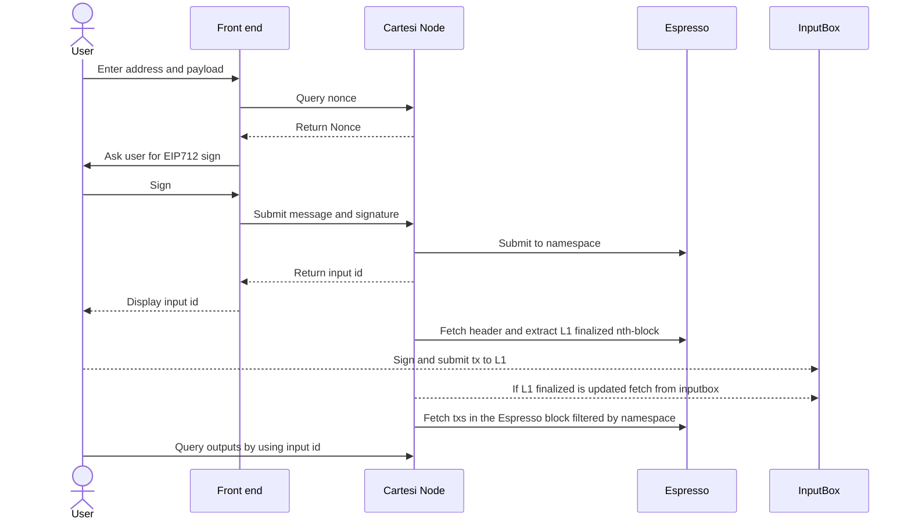

# Espresso + Cartesi

Diagram:



## Running Nonodo for local development

```bash
go build . && ./nonodo
```

## Running Nonodo for testnet development with Espresso

```bash
go build . && ./nonodo --contracts-application-address 0x70ac08179605AF2D9e75782b8DEcDD3c22aA4D0C --sequencer espresso -d --from-block <blocknumber> --rpc-url <sepolia> --espresso-url <espresso-url>
```
