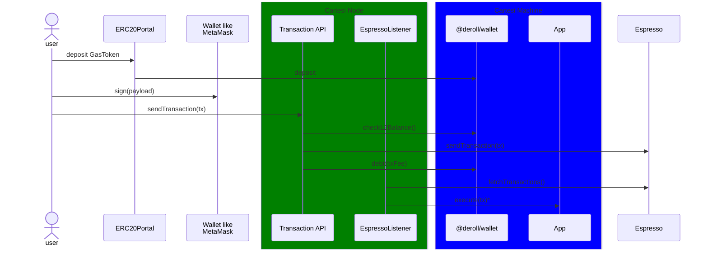

# Sequencer

## Sending a Transaction

Proposal

```mermaid
sequenceDiagram
    actor user
    participant ERC20Portal
    participant MetaMask as Wallet like<br>MetaMask
    box Green Cartesi Node
        participant TxAPI as Transaction API
        participant EspressoListener
    end
    box Blue Cartesi Machine
        participant CartesiBank as @deroll/wallet
        participant App
    end
    participant Espresso
    user->>ERC20Portal: deposit GasToken
    ERC20Portal->>CartesiBank: deposit
    user->>MetaMask: sign(payload)
    user->>TxAPI: sendTransaction(tx)
    TxAPI->>CartesiBank: checkL2Balance()
    TxAPI->>Espresso: sendTransaction(tx)
    TxAPI->>CartesiBank: debit(txFee)
    EspressoListener->>Espresso: fetchTransactions()
    EspressoListener->>App: execute(tx)*
```
## Executing a Transaction

