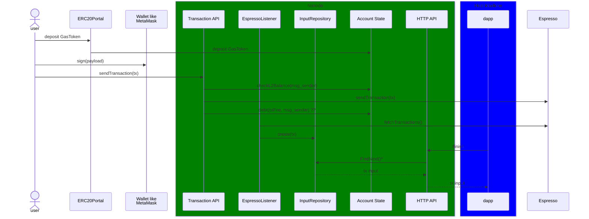
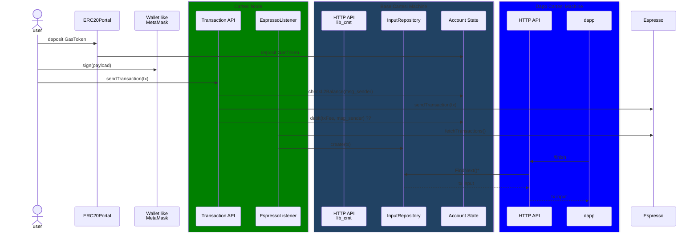
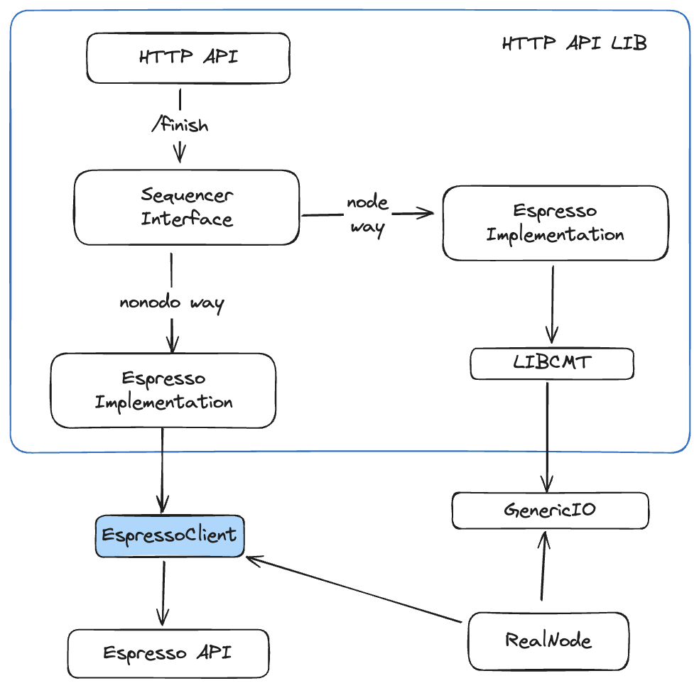

# Sequencer

## Sending a Transaction

HTTP API Proposal for Nonodo Implementation

```mermaid
sequenceDiagram
    actor user
    participant ERC20Portal
    participant MetaMask as Wallet like<br>MetaMask
    box Green Nonodo
        participant TxAPI as Transaction API
        participant EspressoListener
        participant InputRepository
        participant CartesiBank as Account State
        participant HTTP_API as HTTP API
    end
    box Blue Host Machine
        participant App as dapp
    end
    participant Espresso
    user->>ERC20Portal: deposit GasToken
    ERC20Portal->>CartesiBank: deposit GasToken
    user->>MetaMask: sign(payload)
    user->>TxAPI: sendTransaction(tx)
    TxAPI->>CartesiBank: checkL2Balance(msg_sender)
    TxAPI->>Espresso: sendTransaction(tx)
    TxAPI->>CartesiBank: debit(txFee, msg_sender) ??
    EspressoListener->>Espresso: fetchTransactions()
    EspressoListener->>InputRepository: create(tx)
    App->>HTTP_API: /finish
    HTTP_API->>InputRepository: FindNext()*
    InputRepository-->>HTTP_API: tx input
    HTTP_API-->>App: tx input
```

HTTP API Proposal for Rollups Node Implementation

```mermaid
sequenceDiagram
    actor user
    participant ERC20Portal
    participant MetaMask as Wallet like<br>MetaMask
    box Green Cartesi Node
        participant TxAPI as Transaction API
        participant EspressoListener
    end
    box rgb(33,66,99) Base Cartesi Machine
        participant HTTP_LIB_CMT as HTTP API<br>lib_cmt
        participant InputRepository
        participant CartesiBank as Account State
    end
    box Blue Dapp Cartesi Machine
        participant HTTP_API as HTTP API
        
        participant App as dapp
    end
    participant Espresso
    user->>ERC20Portal: deposit GasToken
    ERC20Portal->>CartesiBank: deposit GasToken
    user->>MetaMask: sign(payload)
    user->>TxAPI: sendTransaction(tx)
    TxAPI->>CartesiBank: checkL2Balance(msg_sender)
    TxAPI->>Espresso: sendTransaction(tx)
    TxAPI->>CartesiBank: debit(txFee, msg_sender) ??
    EspressoListener->>Espresso: fetchTransactions()
    EspressoListener->>InputRepository: create(tx)
    App->>HTTP_API: /finish
    HTTP_API->>InputRepository: FindNext()*
    InputRepository-->>HTTP_API: tx input
    HTTP_API-->>App: tx input
```

## Executing a Transaction

